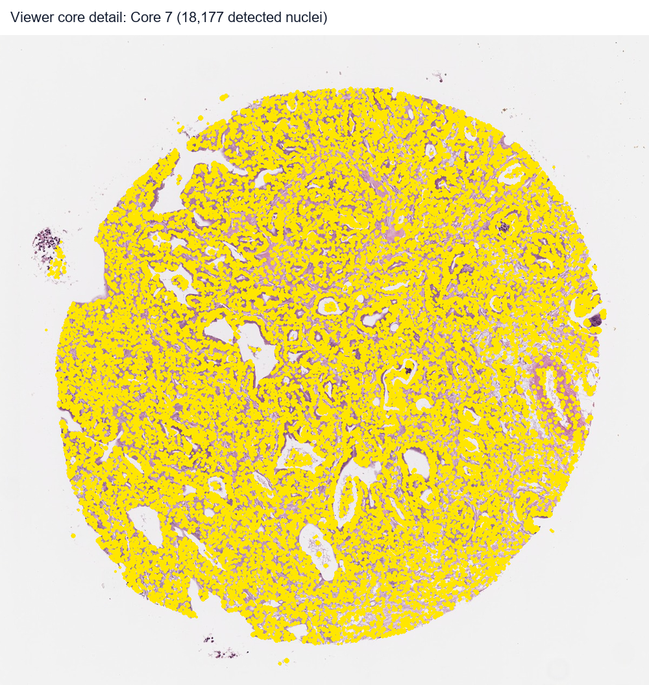
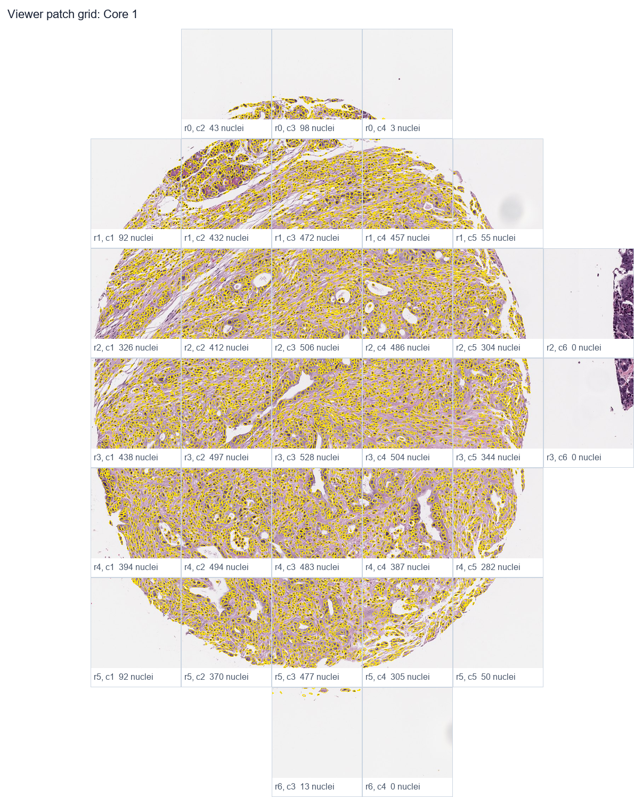
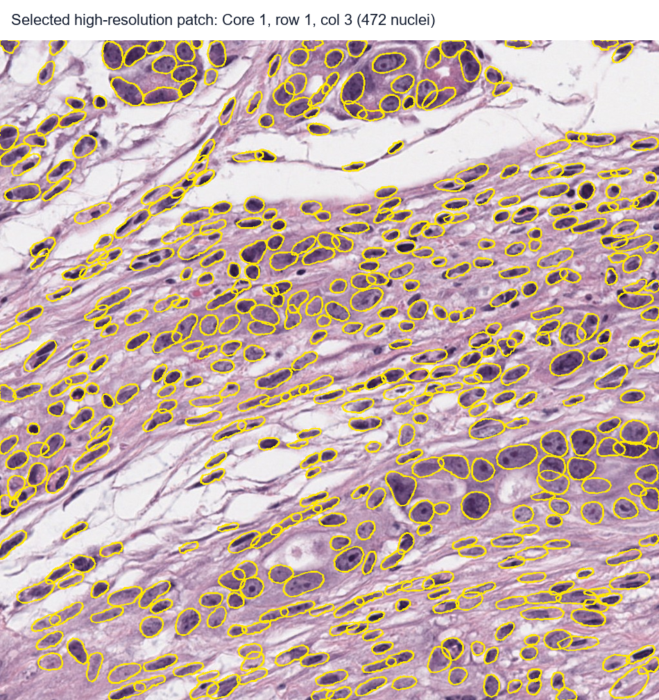
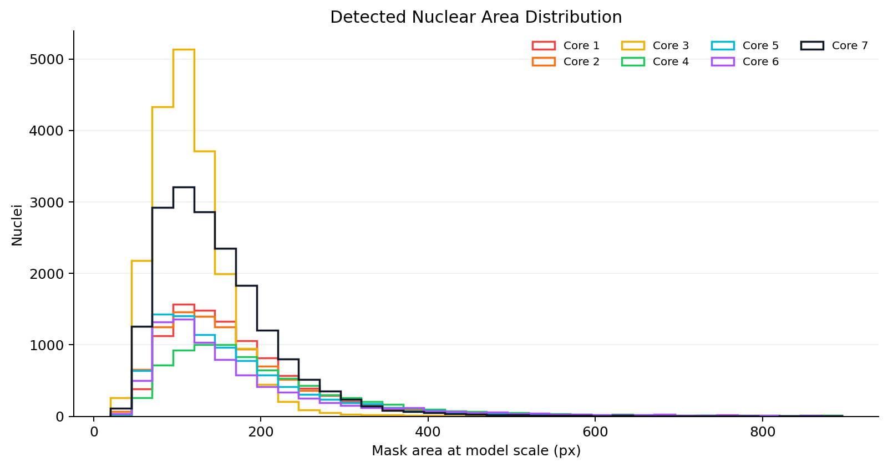

# StarDist Nuclear Segmentation

Scale-aware nuclear segmentation and interactive review for H&E tissue microarray whole-slide images.

## Overview

This repository contains a complete analysis workflow for segmenting nuclei from 40x TMA whole-slide images using the pretrained StarDist `2D_versatile_he` model. The current working comparison includes `1-pathology core stained.svs` and `Jiankang TMA.svs`, both scanned at `0.2522 um/px`, with image tiles normalized to approximately `0.5027 um/px` before StarDist inference so the nuclei are presented near the model's expected scale.

The project outputs lightweight summary files and a self-contained HTML viewer for spatial review of cores, local image tiles, and nuclei.


## Interactive Viewer

Download the current viewers from the GitHub Release assets:

- [`1path_stardist_nuclear_viewer.html`](https://github.com/rf2960/stardist-nuclear-segmentation/releases/download/viewer-v1/1path_stardist_nuclear_viewer.html)
- [`jiankang_stardist_nuclear_viewer.html`](https://github.com/rf2960/stardist-nuclear-segmentation/releases/download/viewer-v1/jiankang_stardist_nuclear_viewer.html)

The viewer includes:

- seven fitted core regions on the slide overview
- per-core high-resolution inspection
- spatially ordered local image-tile grids
- clickable high-resolution tile popups
- boundary show/hide and opacity controls inside the tile popup





Selected tile example used for visual review: **Core 1, row 1, col 3**, containing **472 detected nuclei**.



## Method

Processing steps:

1. Read the 40x SVS slide with OpenSlide.
2. Detect seven tissue cores from a low-resolution overview.
3. Fit tight display circles for core-level visualization.
4. Build stain-gated tissue masks so boundary tissue can be included without inflating the displayed circles.
5. Tile each core using overlapping local image tiles.
6. Downsample 40x tiles to approximately 20x-equivalent scale for StarDist.
7. Run pretrained StarDist nuclear segmentation with per-core thresholds.
8. Filter detections by tissue signal and nuclear mask size.
9. Deduplicate detections across overlapping tile boundaries.
10. Export CSV summaries, publication figures, and a self-contained HTML viewer.

## Candidate Slide Comparison

Both candidate slides were processed with the same core detection, scale normalization, StarDist thresholds, mask-size filtering, stain filtering, and HTML export logic.

| Slide | Total nuclei | Core 1 | Core 2 | Core 3 | Core 4 | Core 5 | Core 6 | Core 7 |
| --- | ---: | ---: | ---: | ---: | ---: | ---: | ---: | ---: |
| 1-pathology core stained | 82,032 | 9,873 | 9,793 | 19,458 | 7,971 | 8,893 | 7,867 | 18,177 |
| Jiankang TMA | 62,599 | 8,515 | 7,233 | 13,610 | 6,642 | 7,429 | 6,331 | 12,839 |

The Jiankang slide is useful for checking alignment with the other overlay data, but it is visibly paler and produces fewer StarDist detections under the same parameters. The final slide choice should therefore be based on the visual overlay fit plus whether the lower nuclear contrast in Jiankang is acceptable.

The lightweight comparison table is also saved as [`results_comparison.csv`](results_comparison.csv).

## 1-Path Results

The current tuned 1-path pipeline detected **82,032 nuclei** across seven cores.

| Core | Detected nuclei |
| --- | ---: |
| Core 1 | 9,873 |
| Core 2 | 9,793 |
| Core 3 | 19,458 |
| Core 4 | 7,971 |
| Core 5 | 8,893 |
| Core 6 | 7,867 |
| Core 7 | 18,177 |


The tuned version increased sensitivity from **79,713** to **82,032** nuclei, a gain of **2,319 detections** or about **2.9%**. This should be interpreted as improved detection sensitivity, especially for small nuclei, not as a measured 2.9% accuracy improvement because no manually annotated ground truth is included.

The selected review tile above is **Core 1, row 1, col 3**. The smoothed curve below summarizes the area of each predicted nuclear mask. Here, a mask means the closed StarDist-predicted nuclear region outlined in yellow in the viewer.



## Practical Ceiling

Within the constraint of using the pretrained StarDist H&E model only, without manual labels or model fine-tuning, the current output is close to the practical best result we can expect from parameter tuning and post-processing alone. The current workflow already combines scale normalization, per-core probability thresholds, object-size filtering, tissue-signal filtering, boundary-aware core inclusion, and duplicate removal.

Further gains are still possible, but they would likely require one of the following:

- a small manually annotated validation set
- model fine-tuning on this staining/scanner domain
- a second classifier to reject low-confidence false positives
- manual correction for publication-critical regions

## Known Limitations

The remaining errors are uncommon but expected for a pretrained model:

- Some boundaries may still be drawn over pale or ambiguous regions with no clear black nucleus.
- Some large predicted boundaries may contain multiple small dark nuclei, especially where nuclei touch or overlap.
- Very faint small nuclei may still be missed if their hematoxylin signal is weak.
- The exported counts should be treated as computational estimates, not manual pathology-grade ground truth.

These limitations are why the HTML viewer is part of the deliverable: it makes core-level and tile-level review transparent rather than hiding the model's residual uncertainty.

## Project Novelty

The useful contribution here is not a new neural network architecture, but a practical, reproducible analysis wrapper around StarDist for high-resolution TMA review:

- 40x-to-model-scale normalization for pretrained StarDist inference
- tight visual core circles combined with separate boundary-aware tissue inclusion
- stain-gated filtering to reduce blank-space false positives
- spatial image-tile grids that preserve tissue location
- self-contained HTML review file requiring no server or Python environment
- lightweight GitHub summaries suitable for sharing without committing large raw slides

## Repository Layout

```text
scripts/
  run_1path_analysis_pipeline.py      # final scale-aware segmentation and HTML export
  create_publication_figures.py       # regenerates README figures
  run_tma2_stardist_clear.py          # earlier TMA2 experiment
  enhance_tma2_html_analysis.py       # earlier TMA2 viewer enhancement

docs/figures/
  overview_1path_cores.png
  viewer_core_detail_core7.png
  viewer_patch_grid_core1.png
  viewer_selected_patch_core1_row1_col3.png
  core_counts_1path.png
  density_1path.png
  nuclear_area_histogram.png

results_1path_analysis/
  analysis_summary_1path.csv
  core_counts_1path.csv

results_jiankang_analysis/
  analysis_summary_jiankang.csv
  core_counts_jiankang.csv

results_comparison.csv
```

Large raw slides, generated JSON, detected-cell CSVs, and self-contained HTML viewers are intentionally ignored by Git and kept locally or distributed through GitHub Releases.

## Reproducibility

Create an environment with OpenSlide, StarDist, TensorFlow, and the dependencies in `requirements.txt`.

Run the final pipeline:

```powershell
python scripts/run_1path_analysis_pipeline.py
```

Regenerate README figures:

```powershell
python scripts/create_publication_figures.py
```
