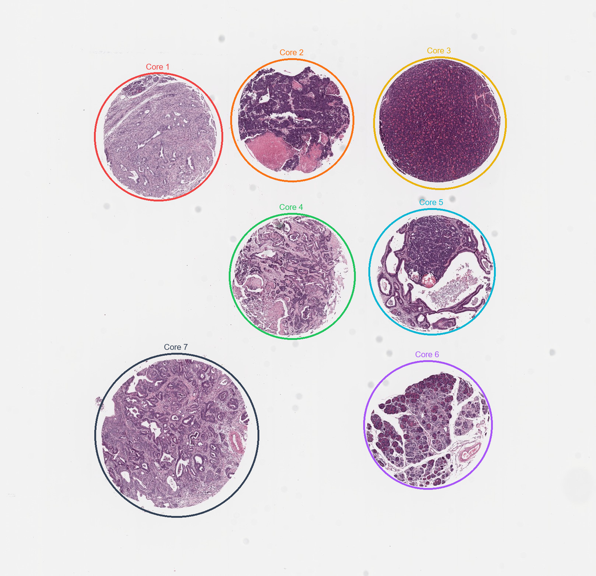
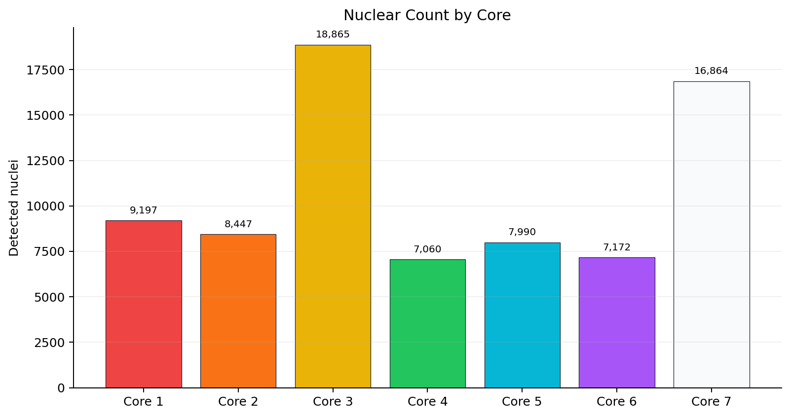
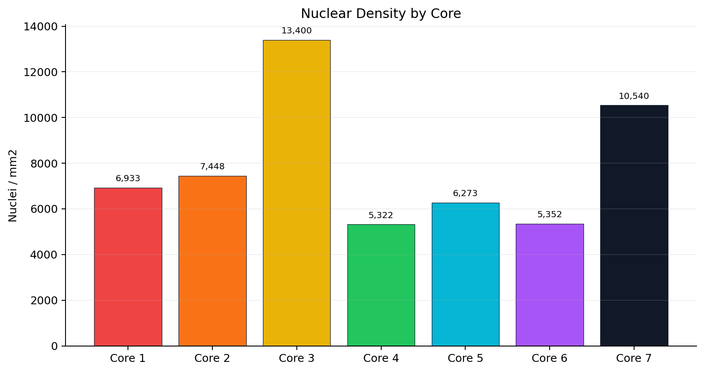

# StarDist Nuclear Segmentation

Scale-aware StarDist nuclear segmentation and interactive analysis for tissue microarray whole-slide images.

## Overview

This project analyzes H&E-stained tissue cores using the pretrained StarDist `2D_versatile_he` model. The final analysis normalizes patch scale for model inference and exports an interactive local HTML viewer plus lightweight GitHub summaries.



## Final Input

The final interactive analysis was generated from `1-pathology core stained.svs`, a 40x H&E TMA slide scanned at `0.2522 um/px`.

## Method

The final slide is 40x, while the StarDist H&E model performs best when nuclei appear near the training scale. The pipeline therefore reads high-resolution 40x tissue patches, downsamples them to approximately 20x (`0.5027 um/px`) for segmentation, and maps detected nuclei back to the original 40x coordinate space for visualization.

Processing steps:

1. Detect seven tissue cores from a low-resolution slide overview.
2. Fit tight overview circles for the seven cores.
3. Build stain-gated tissue masks so boundary tissue can be included without inflating the displayed circles.
4. Tile each core with overlapping patches.
5. Scale-normalize 40x patches to model resolution.
6. Run StarDist nuclear segmentation with per-core thresholds and reject blank-background false positives.
7. Remove duplicate detections at tile boundaries.
8. Export per-core summaries, spatial patch grids, and a local interactive HTML viewer.

## Results

Final segmentation detected **82,032 nuclei** across seven cores.





The committed result summaries are small CSV files:

- [`results_1path_analysis/analysis_summary_1path.csv`](results_1path_analysis/analysis_summary_1path.csv)
- [`results_1path_analysis/core_counts_1path.csv`](results_1path_analysis/core_counts_1path.csv)

## Interactive HTML Viewer

The final local viewer is:

`results_1path_analysis/1path_stardist_analysis.html`

It is intentionally **not committed to normal Git history** because it is a self-contained file of about 185 MB, larger than GitHub's normal file-size limit.

Download the public GitHub Release asset here:

[`1path_stardist_nuclear_viewer_2026-04-29_modal.html`](https://github.com/rf2960/stardist-nuclear-segmentation/releases/download/viewer-v1/1path_stardist_nuclear_viewer_2026-04-29_modal.html)

The viewer includes:

- fitted overview core circles
- high-resolution core inspection
- nuclei overlays
- spatial patch grid
- segmentation overlay toggle for clean patch review
- clickable high-resolution patch popups

The repository keeps the code, figures, and lightweight summaries in Git; the large HTML is distributed through GitHub Releases.

## Repository Layout

```text
scripts/
  run_1path_analysis_pipeline.py      # final 40x scale-aware pipeline
  create_publication_figures.py       # generates README figures
  run_tma2_stardist_clear.py          # earlier TMA2 pipeline
  enhance_tma2_html_analysis.py       # interim TMA2 HTML enhancement

docs/figures/
  overview_1path_cores.png
  core_counts_1path.png
  density_1path.png

results_1path_analysis/
  analysis_summary_1path.csv
  core_counts_1path.csv
```

Large raw slides and generated self-contained HTML/JSON/CSV outputs are ignored by Git and kept locally.

## Reproducibility

Create an environment with OpenSlide, StarDist, TensorFlow, and the dependencies in `requirements.txt`.

Run the final pipeline:

```powershell
python scripts/run_1path_analysis_pipeline.py
```

Regenerate README figures:

```powershell
python scripts/create_publication_figures.py
```
