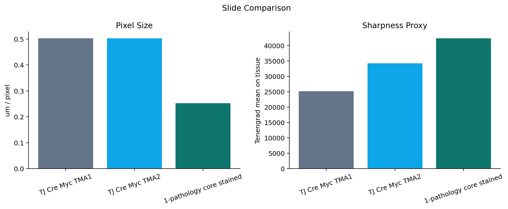

# StarDist Nuclear Segmentation

Scale-aware StarDist nuclear segmentation and interactive analysis for tissue microarray whole-slide images.

## Overview

This project analyzes H&E-stained tissue cores using the pretrained StarDist `2D_versatile_he` model. The final analysis uses the highest-resolution slide in the local dataset, normalizes patch scale for model inference, and exports an interactive local HTML viewer plus lightweight GitHub summaries.


## Final Dataset

The final interactive analysis was generated from:

`1-pathology core stained.svs`

This slide was selected because it is the highest-resolution input:

| File | Objective | Pixel size | Dimensions |
| --- | ---: | ---: | ---: |
| `TJ Cre Myc TMA1.svs` | 20x | 0.5027 um/px | 13944 x 13644 |
| `TJ Cre Myc TMA2.svs` | 20x | 0.5027 um/px | 11952 x 12505 |
| `1-pathology core stained.svs` | 40x | 0.2522 um/px | 25896 x 25028 |

`TJ Cre Myc TMA1 2.svs` was removed locally because it was byte-identical to `TJ Cre Myc TMA1.svs`.

## Method

The final slide is 40x, while the StarDist H&E model performs best when nuclei appear near the training scale. The pipeline therefore reads high-resolution 40x tissue patches, downsamples them to approximately 20x (`0.5027 um/px`) for segmentation, and maps detected nuclei back to the original 40x coordinate space for visualization.

Processing steps:

1. Detect seven tissue cores from a low-resolution slide overview.
2. Fit core centers and circular tissue regions.
3. Tile each core with overlapping patches.
4. Scale-normalize 40x patches to model resolution.
5. Run StarDist nuclear segmentation with per-core thresholds.
6. Remove duplicate detections at tile boundaries.
7. Export per-core summaries, spatial patch grids, and a local interactive HTML viewer.

## Results

Final segmentation detected **75,595 nuclei** across seven cores.


The committed result summaries are small CSV files:

- [`results_1path_analysis/analysis_summary_1path.csv`](results_1path_analysis/analysis_summary_1path.csv)
- [`results_1path_analysis/core_counts_1path.csv`](results_1path_analysis/core_counts_1path.csv)
- [`results_1path_analysis/slide_comparison.csv`](results_1path_analysis/slide_comparison.csv)

## Slide Quality Comparison

The 40x pathology slide has the smallest pixel size and the highest sharpness proxy among the compared slides.



## Interactive HTML Viewer

The final local viewer is:

`results_1path_analysis/1path_stardist_analysis.html`

It is intentionally **not committed to GitHub** because it is a self-contained file of about 169 MB, larger than GitHub's normal file-size limit. The viewer remains available locally and includes:

- fitted overview core circles
- high-resolution core inspection
- nuclei overlays
- spatial patch grid
- clickable high-resolution patch popups

To share the viewer publicly, upload the HTML as a GitHub Release asset or to a cloud drive, then add that download/open link here. The repository keeps the code, figures, and lightweight summaries; the large HTML stays outside normal Git history.

## Repository Layout

```text
scripts/
  run_1path_analysis_pipeline.py      # final 40x scale-aware pipeline
  create_publication_figures.py       # generates README figures
  run_tma2_stardist_clear.py          # earlier TMA2 pipeline
  enhance_tma2_html_analysis.py       # interim TMA2 HTML enhancement

docs/figures/
  overview_1path_cores.png
  core_counts_1path.png
  density_1path.png
  slide_comparison.png

results_1path_analysis/
  analysis_summary_1path.csv
  core_counts_1path.csv
  slide_comparison.csv
```

Large raw slides and generated self-contained HTML/JSON/CSV outputs are ignored by Git and kept locally.

## Reproducibility

Create an environment with OpenSlide, StarDist, TensorFlow, and the dependencies in `requirements.txt`.

Run the final pipeline:

```powershell
python scripts/run_1path_analysis_pipeline.py
```

Regenerate README figures:

```powershell
python scripts/create_publication_figures.py
```
